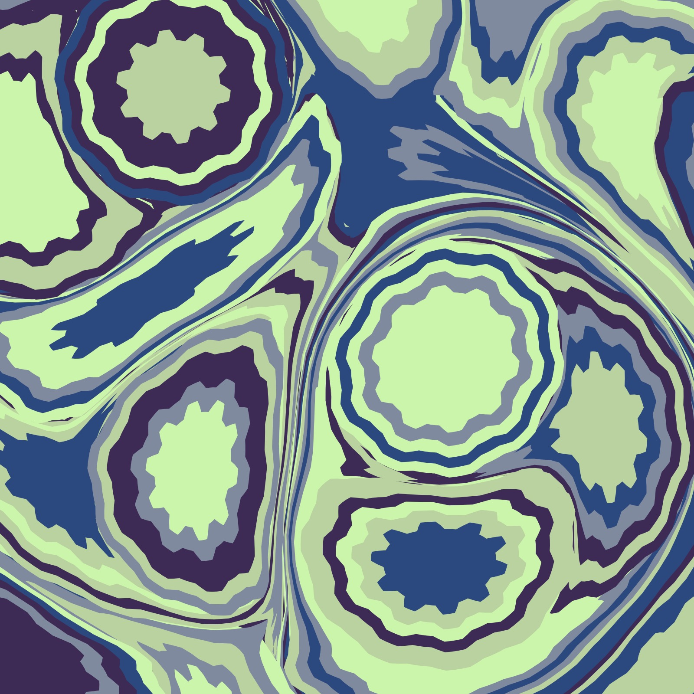

# Mathematical Marbling

Paper marbling is a captivating traditional art form that involves floating paints on a thickened liquid surface, manipulating them into intricate patterns, and then transferring those patterns onto paper or fabric. It originated in Japan in the twelfth century and later spread to Turkey and other parts of the world.

The art of paper marbling requires both skill and creativity, as artists must master the delicate balance of paint consistency, surface tension, and timing to create stunning and harmonious designs. Mathematical marbling, also known as computational or digital marbling, is a cool way of making patterns that look like those made with traditional paper marbling, but it's done using math and computers instead of paints and trays.

Here's how it works in simple terms: Imagine you have a grid, like graph paper. Each square on the grid can be colored in different ways, just like how you'd put different colored paints on the surface in traditional marbling. Instead of dropping paint, though, we use mathematical equations to figure out how to color each square based on its position and its relationship with neighboring squares.

Base [code](https://editor.p5js.org/codingtrain/sketches/fsw-rJrpr) from [Daniel Shiffman](https://thecodingtrain.com) - Mathematical Marbling Coding Challenge coming soon.

### Dropping the paint

### Adding the tine strokes

From [The Mathematics of Marbling](http://people.csail.mit.edu/jaffer/Marbling/Mathematics):

$F_v(x, y) = (x, y + z \cdot u |x - x_L|)$

$u = \frac{1}{2}^\frac{1}{c}$

The parameters z, u(c) control maximum displacement and sharpness of bends. A larger z yields a larger displacement, while a smaller c results in sharper bends.

## 🌄 Gallery

<!-- IMAGE-LIST:START - Do not remove or modify this section -->
<!-- prettier-ignore-start -->
<!-- markdownlint-disable -->
<table>
  <tbody>
  <tr>
      <td align="center"><a href="">  <b> Marbling with evenly spaced blobs - no tines</b></a></td>
      <td align="center"><a href="">  <b> Ink blobs with knobs</b></a></td>
       <td align="center"><a href="">  <b> Using gear curve instead of circle</b></a></td>
     <td align="center"><a href="">  <b> Ink blobs added with Phyllotaxis </b></a></td>
</tr>
    <tr>
      <td align="center"><a href="">  <b> Evenly spaced ink blobs</b></a></td>
     <td align="center"><a href="">  <b> Evenly spaced ink blobs</b></a></td>
      <td align="center"><a href="">  <b> Marbling with central ink blobs</b></a></td>
    <td align="center"><a href="">  <b> Marbling with evenly spaced blobs</b></a></td>
</tr>

    
 </tbody>
</table>

<!-- markdownlint-restore -->
<!-- prettier-ignore-end -->

<!-- IMAGE-LIST:END -->

## References

- [A Computational Method for Interactive Design of Marbling Patterns](https://www.researchgate.net/publication/330940964_A_Computational_Method_for_Interactive_Design_of_Marbling_Patterns/link/5e42f45492851c7f7f2f9031/download?_tp=eyJjb250ZXh0Ijp7ImZpcnN0UGFnZSI6InB1YmxpY2F0aW9uIiwicGFnZSI6InB1YmxpY2F0aW9uIn19)
- [Digital Marbling](http://digital-marbling.de)
- [Digital Marbling by Amanda Ghassaei](https://blog.amandaghassaei.com/2022/10/25/digital-marbling/)
- [Digital Marbling a GPU Approach With Precomputed Velocity Field](https://cs.uwaterloo.ca/sites/ca.computer-science/files/uploads/files/cs-2014-08.pdf)
- [Divergence](https://en.wikipedia.org/wiki/Divergence)
- [Efficient and Conservative Fluids Using Bidirectional Mapping](https://www.seas.upenn.edu/~ziyinq/static/files/bimocq.pdf)
- [Fluid Simulation (with WebGL demo)](https://jamie-wong.com/2016/08/05/webgl-fluid-simulation/)
- [Marblizer](https://github.com/nickswalker/marblizer)
- [Marblizer App](https://marblizer.nickwalker.us)
- [Mathematical Marbling](http://www.cad.zju.edu.cn/home/jin/cga2012/mmarbling.pdf)
- [Marbled Paper Patterns](https://content.lib.washington.edu/dpweb/patterns.html)
- [Mabling experiment](https://github.com/amandaghassaei/marbling-experiment/blob/main/src/simulation.ts)
- [Mathematical Marbling How-To](https://people.csail.mit.edu/jaffer/Marbling/How-To) -[Oseen Flow in Paint Marbling](https://arxiv.org/pdf/1702.02106.pdf)
- [Stable Fluids](https://www.dgp.toronto.edu/public_user/stam/reality/Research/pdf/ns.pdf)
- [The Hydrodynamics of Marbling](https://fyfluiddynamics.com/2023/12/the-hydrodynamics-of-marbling/)
- [The Mathematics of Marbling](http://people.csail.mit.edu/jaffer/Marbling/Mathematics) -[Winning Videos Feature Marbling Paint and Freezing Flashes](https://physics.aps.org/articles/v16/201)
- [Watermarble Simulator](https://github.com/rinsavs/watermarble_simulator)

## Videos

[The Hydrodynamics of Marbling Art](https://www.youtube.com/watch?v=yzlPvtDmtAE)

## Code

[incrmt](https://github.com/chr1shr/incrmt)
