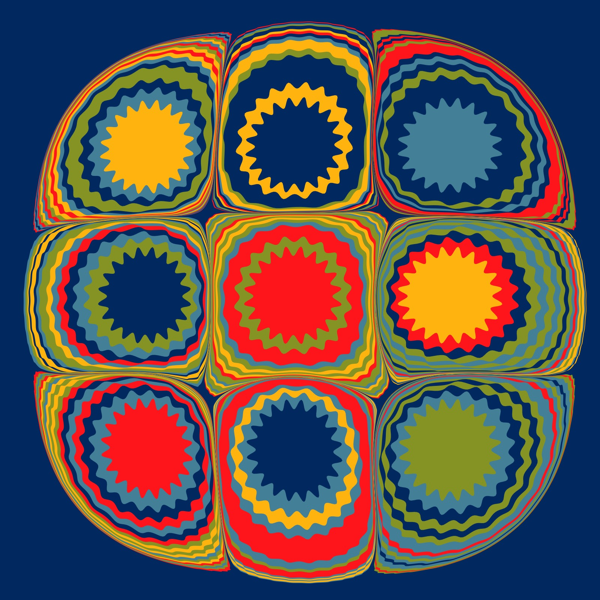
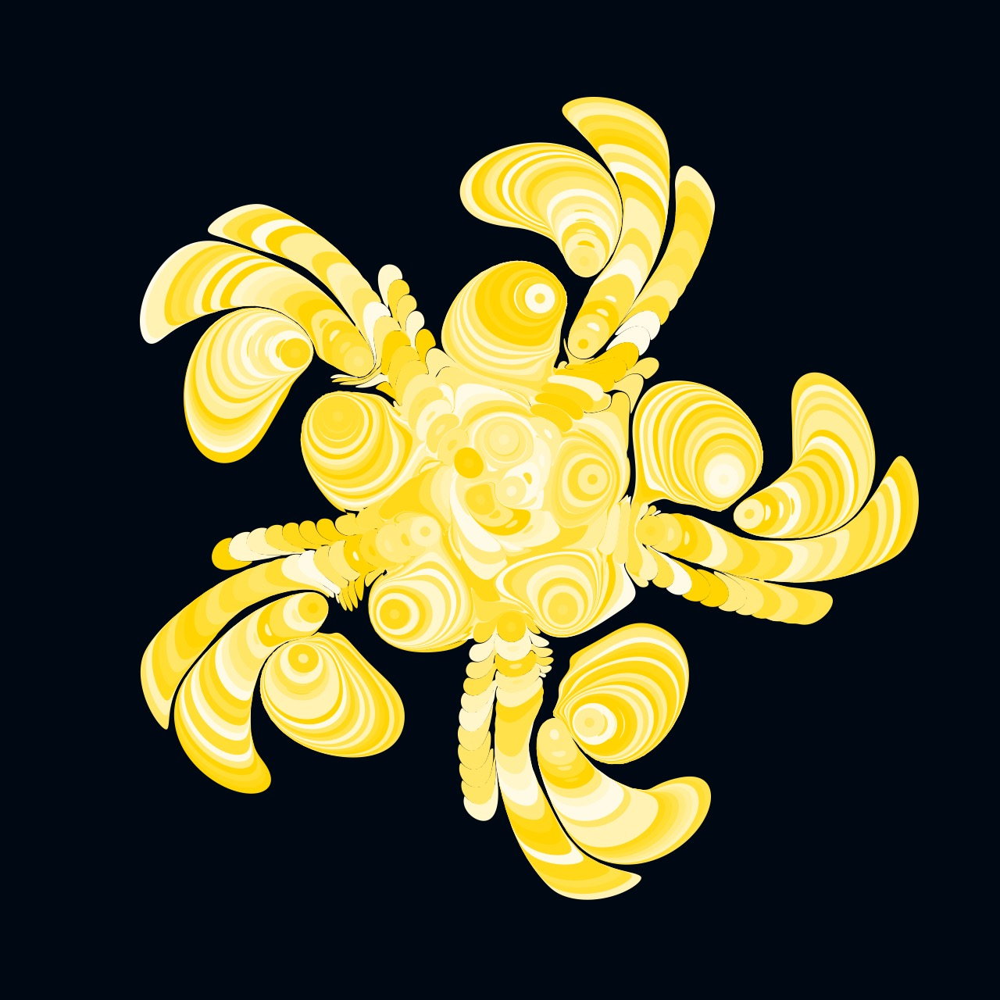

# Mathematical Marbling

Paper marbling is a captivating traditional art form that involves floating paints on a thickened liquid surface, manipulating them into intricate patterns, and then transferring those patterns onto paper or fabric. It originated in Japan in the twelfth century and later spread to Turkey and other parts of the world.

The art of paper marbling requires both skill and creativity, as artists must master the delicate balance of paint consistency, surface tension, and timing to create stunning and harmonious designs. Mathematical marbling, also known as computational or digital marbling, is a cool way of making patterns that look like those made with traditional paper marbling, but it's done using math and computers instead of paints and trays.

Base [code](https://editor.p5js.org/codingtrain/sketches/fsw-rJrpr) from [Daniel Shiffman](https://thecodingtrain.com) - Mathematical Marbling Coding Challenge coming soon.

The math behind the marbling is outlined in [The Mathematics of Marbling](http://people.csail.mit.edu/jaffer/Marbling/Mathematics).

**Dropping the Paint**

As "drops" of paint are added, the existing particles (or points) of paint are displaced. This equation shows how to calculate the new position as additional "drops" of paint are added.

$C + (P - C) \cdot \sqrt{1 + \frac{r^2}{\lVert P - C \rVert^2}}$

This is implemented by Dainel Shiffman in the marble function in the Drop class.

```javascript
marble(other) {
    for (let v of this.vertices) {
      let c = other.center;
      let r = other.r;
      let p = v.copy();
      p.sub(c);
      let m = p.mag();
      let root = sqrt(1 + (r * r) / (m * m));
      p.mult(root);
      p.add(c);
      v.set(p);
    }
  }
```

Since the order in which you add the drops of paint matters, I have randomized the order in which the blobs of paint are added. Additionally, if you edit `p.mult(root)` slightly to `p.mult(0.99*root)` you can get some interesting effects (shown in the first two images). You can also substitute a gear shape in place of a circle and add the blobs of paint in a phyllotaxis pattern (shown in last image in the first row, warning--this is compute heavy!)

**Adding the Tine Strokes**

$F_v(x, y) = (x, y + z \cdot u |x - x_L|)$

$u = \frac{1}{2}^\frac{1}{c}$

The parameters z, u(c) control maximum displacement and sharpness of bends. A larger z yields a larger displacement, while a smaller c results in sharper bends. This was implemented in the tine function in the Drop class, which adds a single tine stroke at a random angle using the mouse. I have edited the code to add a variable number of verticle / horizontal tine strokes.

```javacript
tine(m, x, y, z, c) {
    let u = 1 / pow(2, 1 / c);
    let b = createVector(x, y);
    for (let v of this.vertices) {
      let pb = p5.Vector.sub(v, b);
      let n = m.copy().rotate(HALF_PI);
      let d = abs(pb.dot(n));
      let mag = z * pow(u, d);
      v.add(m.copy().mult(mag));
    }
  }
```

## Gallery

<!-- IMAGE-LIST:START - Do not remove or modify this section -->
<!-- prettier-ignore-start -->
<!-- markdownlint-disable -->
<table>
  <tbody>
  <tr>
      <td align="center"><a href=""> <br /><sub><b><br/>Marbling with evenly spaced blobs - no tines</b></sub></a></td>
      <td align="center"><a href=""> <br /><sub><b><br/>Ink blobs with knobs</b></sub></a></td>
       <td align="center"><a href=""> <br /><sub><b><br/>Swirl</b></sub></a></td>
     <td align="center"><a href=""> <br /><sub><b><br/>Jello Mold (Blobs added using Phyllotaxis)</b></sub></a></td>
</tr>
<tr>
      <td align="center"><a href=""> <br /><sub><b><br/>Adding ink with the rose curve</b></sub></a></td>
      <td align="center"><a href=""> <br /><sub><b><br/>Adding ink with the involute curve</b></sub></a></td>
       <td align="center"><a href=""> <br /><sub><b><br/>Adding ink with the astroid curve</b></sub></a></td>
     <td align="center"><a href=""> <br /><sub><b><br/>Adding ink with the Hypocycloid evolute curve</b></sub></a></td>
</tr>
<tr>
      <td align="center"><a href=""> <br /><sub><b><br/>Adding ink with Quadrifolium curve</b></sub></a></td>
      <td align="center"><a href=""> <br /><sub><b><br/>Adding ink with the heart curve</b></sub></a></td>
       <td align="center"><a href=""> <br /><sub><b><br/>Adding ink with the pedal curve</b></sub></a></td>
     <td align="center"><a href=""> <br /><sub><b><br/>Flower</b></sub></a></td>
</tr>
    <tr>
      <td align="center"><a href=""> <br /><sub><b><br/>Evenly spaced ink blobs</b></sub></a></td>
     <td align="center"><a href=""> <br /><sub><b><br/>Evenly spaced ink blobs</b></sub></a></td>
      <td align="center"><a href=""> <br /><sub><b><br/>Marbling with central ink blobs</b></sub></a></td>
    <td align="center"><a href=""> <br /><sub><b><br/>Marbling with evenly spaced blobs</b></sub></a></td>
</tr>


    
 </tbody>
</table>

<!-- markdownlint-restore -->
<!-- prettier-ignore-end -->

<!-- IMAGE-LIST:END -->

### History of Marbling

- [The Art of Marbled Paper: Dynamic Fluids in Flow](https://www.metmuseum.org/articles/marbled-paper)
- [The Art of Ebru](https://www.baytalfann.com/post/the-art-of-ebru)
- [Suminagashi - The Ancient Art of Japanese Marbling](https://suminagashi.com/history/)

## References

- [A Computational Method for Interactive Design of Marbling Patterns](https://www.researchgate.net/publication/330940964_A_Computational_Method_for_Interactive_Design_of_Marbling_Patterns/link/5e42f45492851c7f7f2f9031/download?_tp=eyJjb250ZXh0Ijp7ImZpcnN0UGFnZSI6InB1YmxpY2F0aW9uIiwicGFnZSI6InB1YmxpY2F0aW9uIn19)
- [Digital Marbling](http://digital-marbling.de)
- [Digital Marbling by Amanda Ghassaei](https://blog.amandaghassaei.com/2022/10/25/digital-marbling/)
- [Digital Marbling a GPU Approach With Precomputed Velocity Field](https://cs.uwaterloo.ca/sites/ca.computer-science/files/uploads/files/cs-2014-08.pdf)
- [Divergence](https://en.wikipedia.org/wiki/Divergence)
- [Efficient and Conservative Fluids Using Bidirectional Mapping](https://www.seas.upenn.edu/~ziyinq/static/files/bimocq.pdf)
- [Fluid Simulation (with WebGL demo)](https://jamie-wong.com/2016/08/05/webgl-fluid-simulation/)
- [Mathematical Marbling](http://www.cad.zju.edu.cn/home/jin/cga2012/mmarbling.pdf)
- [Marbled Paper Patterns](https://content.lib.washington.edu/dpweb/patterns.html)
- [Mabling experiment](https://github.com/amandaghassaei/marbling-experiment/blob/main/src/simulation.ts)
- [Mathematical Marbling How-To](https://people.csail.mit.edu/jaffer/Marbling/How-To)
- [Oseen Flow in Paint Marbling](https://arxiv.org/pdf/1702.02106.pdf)
- [Stable Fluids](https://www.dgp.toronto.edu/public_user/stam/reality/Research/pdf/ns.pdf)
- [The Hydrodynamics of Marbling](https://fyfluiddynamics.com/2023/12/the-hydrodynamics-of-marbling/)
- [The Mathematics of Marbling](http://people.csail.mit.edu/jaffer/Marbling/Mathematics)
- [Trying out digital marbling](https://theartsquirrel.com/2968/trying-out-digital-marbling/)
- [Winning Videos Feature Marbling Paint and Freezing Flashes](https://physics.aps.org/articles/v16/201)
- [The Lamb-Oseen Vortex and Paint Marbling](https://arxiv.org/pdf/1810.04646.pdf)
- [Watermarble Simulator](https://github.com/rinsavs/watermarble_simulator)

## Videos

- [The Hydrodynamics of Marbling Art](https://www.youtube.com/watch?v=yzlPvtDmtAE)

## Code

- [incrmt](https://github.com/chr1shr/incrmt)
- [Marblizer](https://github.com/nickswalker/marblizer)
- [Marblizer App](https://marblizer.nickwalker.us)
- [Watermarble Simulator](https://github.com/rinsavs/watermarble_simulator)
- [MarblingModoki_1.0](https://openprocessing.org/sketch/1349418)
